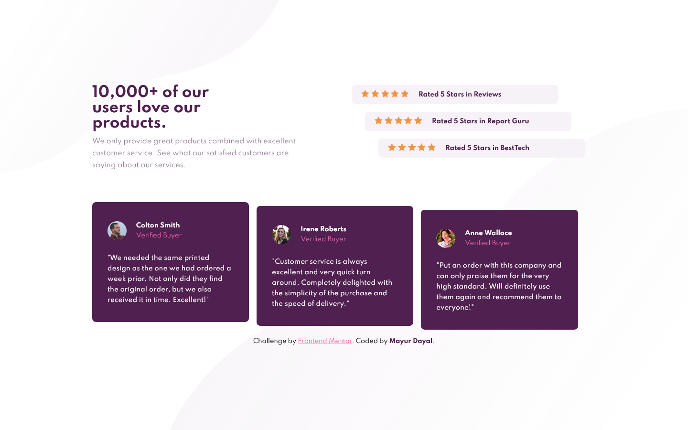

# Frontend Mentor - Social proof section

This is a solution to the [Social proof section challenge on Frontend Mentor](https://www.frontendmentor.io/challenges/social-proof-section-6e0qTv_bA). Frontend Mentor challenges help you improve your coding skills by building realistic projects. 

## The challenge

Your challenge is to build out this social proof section and get it looking as close to the design as possible.

You can use any tools you like to help you complete the challenge. So if you've got something you'd like to practice, feel free to give it a go.

Users should be able to:

- View the optimal layout for the section depending on their device's screen size

**To do this challenge, you need a basic understanding of HTML and CSS.**

## Screenshot

### Mobile Screenshot

### Desktop Screenshot

## Links

- Solution URL: [https://github.com/mayurDayal2000/social-proof-section-main](https://github.com/mayurDayal2000/social-proof-section-main)
- Live Site URL: [https://mayurdayal2000.github.io/social-proof-section-main/](https://mayurdayal2000.github.io/social-proof-section-main/)

## Built with

- Semantic HTML5 markup
- CSS custom properties
- Flexbox
- CSS Grid
- Mobile-first workflow

## Author

- Frontend Mentor - [@mayurDayal2000](https://www.frontendmentor.io/profile/mayurDayal2000)
- Twitter - [@mayur_dayal_5k](https://twitter.com/mayur_dayal_5k)